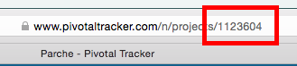

# PivotalTrackerScrumBoard
A scrum board for your Pivotal Tracker current column. 
This was a Vokal hack day project February 2015.

To use the scrum board you need your [Pivotal Tracker token](https://www.pivotaltracker.com/help/faq#wherecanifindmyapitoken) and your project ID. 

See it in action at [http://www.seanzach.com/scrumboard/](http://www.seanzach.com/scrumboard/)
